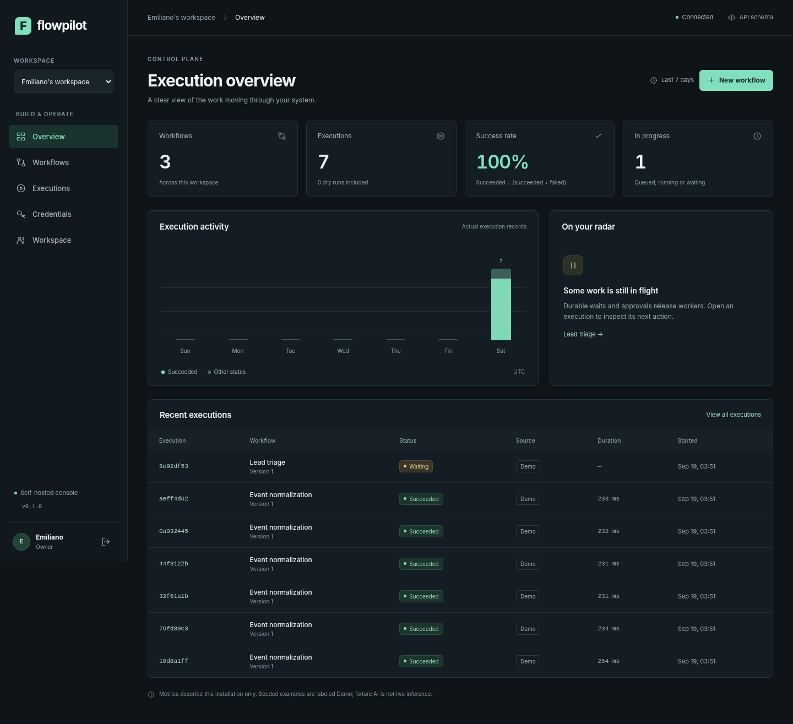
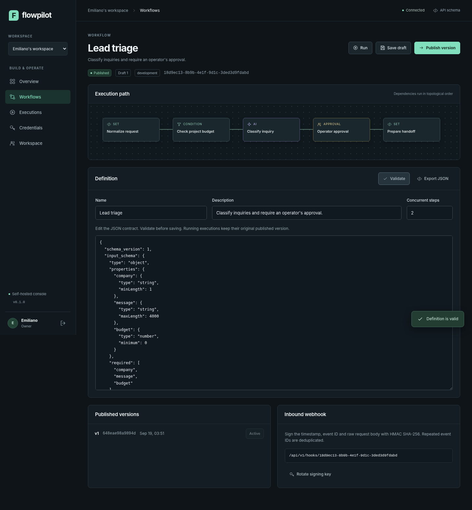
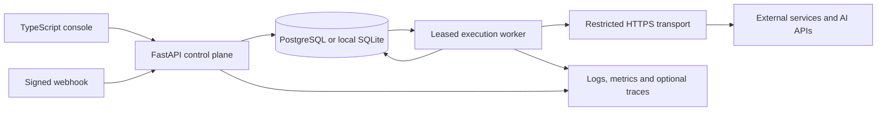

<div align="center">

# FlowPilot

Durable workflows. Explicit side effects. Inspectable execution.

[Run locally](#run-locally) &nbsp; [Architecture](docs/architecture.md) &nbsp; [Workflow contract](docs/workflow-spec.md) &nbsp; [Verification](verification/REPORT.md)

</div>



FlowPilot receives an event, executes a versioned workflow and keeps a record of each step. A worker can disappear without taking the execution history with it. Operators can inspect failures, approve sensitive actions, cancel waiting work and replay a run deliberately.

FlowPilot is a self-hosted workflow execution service for small software teams. The screenshot shows locally executed demo records. The bundled AI example uses a deterministic fixture, so the local walkthrough does not require a paid provider account.

## What works

| Capability | Behavior |
| :--- | :--- |
| Workflow definitions | Validated DAGs, immutable published versions and optimistic draft updates |
| Execution | Database queue, fenced leases, bounded retries and recovery after worker loss |
| Durable waits | Delays and human approvals persist without holding a worker |
| Integrations | Signed inbound webhooks and outbound HTTPS with explicit destination policy |
| AI APIs | Adapters for OpenAI, Anthropic and Gemini; local validation of structured responses |
| Workspaces | Organization membership, project boundaries and four permission roles |
| Credentials | Envelope encryption, version pinning, rotation and revocation |
| Console | Workflow graph, JSON editor, execution timeline, credential controls and audit trail |
| Operations | Readiness checks, Prometheus text metrics, structured logs and optional OTLP spans |

## Run locally

Python 3.12 or 3.13 is required. The compiled console is included, so Node is not required to try the application.

```bash
python -m venv .venv
source .venv/bin/activate
python -m pip install -r requirements.lock
python -m pip install --no-deps -e .
python scripts/dev.py
```

On Windows, replace the activation command with `.venv\Scripts\Activate.ps1` in PowerShell. Use a current pip and setuptools if editable installation reports a build error.

Open **http://localhost:8000**. The bootstrap script prints a newly generated demo password and saves it in your private `.env`. It does not overwrite an existing configuration. Sign in with `demo@flowpilot.local`.

Three workflow examples are created. **Lead triage** waits for your approval after a deterministic AI fixture. **Event normalization** has several real local execution records. **Reviewed delivery** remains a draft until you configure an allowed destination. No live external requests are needed for this walkthrough.

Stop both processes with `Ctrl+C`. SQLite data remains in `var/flowpilot.db`.

[Windows and troubleshooting](docs/development.md) &nbsp; [Container setup](docs/deployment.md)

## A useful first walkthrough

Open **Lead triage**, inspect its graph and JSON contract, then open its waiting execution. Approve the review step. The worker resumes from stored state and completes the handoff payload. Editing and publishing the workflow afterward does not change that execution's original version.

Try a dry replay. It creates a new run, preserves the original workflow version and labels simulated outputs. A live replay requires a separate acknowledgment because it can repeat external side effects.



## Architecture



The queue and execution state share a database transaction. PostgreSQL is the deployment target. SQLite is the tested, low-cost local mode. Redis is intentionally absent: this version does not need another state store to acknowledge the same event.

The browser console uses strict TypeScript and native DOM APIs. It has no runtime package dependencies or external assets. The UI communicates through the same documented API available to other clients.

| Boundary | Implementation |
| :--- | :--- |
| HTTP and permissions | `src/flowpilot/api/` |
| Workflow validation and execution | `src/flowpilot/engine/` |
| External HTTP and AI adapters | `src/flowpilot/integrations/` |
| Persistence and encryption | `models.py`, `db.py`, `crypto.py` |
| Transactional commands | `services.py` |
| Browser console | `web/src/` |

## Test and inspect

```bash
python -m pip install -e ".[dev]"
npm ci
python scripts/check.py
```

The check runs backend tests, statement coverage, strict TypeScript checking, the console build and frontend unit tests. The browser walkthrough is separate:

```bash
python -m playwright install chromium
python scripts/browser_smoke.py
```

[The verification report](verification/REPORT.md) records the current local verification snapshot and lists checks that still require PostgreSQL, containers, live provider credentials or a normal browser environment. Test counts and coverage are engineering signals, not a security certification.

## Guarantees and boundaries

A committed run contains its input, workflow version and initial step records. A stale worker cannot commit a result after losing its lease. This is not an exactly-once guarantee for external APIs: a request may succeed before the worker persists its result.

Unsafe HTTP actions without receiver-side idempotency are not retried automatically after an uncertain worker failure. They fail with `outcome_unknown` for an operator to investigate. Replay deliberately creates a new side-effect identity.

A run's steps execute sequentially in dependency order. Different runs can execute concurrently. There is no arbitrary code node, autonomous tool loop, built-in OAuth account linking, cron scheduler, SSO, billing or visual drag-and-drop editor. The graph is an inspection surface; the JSON contract is the editor.

Before any public deployment, complete the PostgreSQL and container checks, review the threat model, configure HTTPS, egress restrictions, backups, retention and real credentials. Do not expose the local demo as a public service.

## Documentation

| Document | Purpose |
| :--- | :--- |
| [Code tour](docs/code-tour.md) | A short route through the execution engine, HTTP boundary and tests |
| [Architecture](docs/architecture.md) | Boundaries, data model and tradeoffs |
| [Execution semantics](docs/execution.md) | Leases, waits, retries, replay and failure windows |
| [Workflow contract](docs/workflow-spec.md) | Node types, references, validation and examples |
| [API](docs/api.md) | Authentication, request conventions and webhook signing |
| [Security](docs/security.md) | Trust boundaries, controls and residual risks |
| [Development](docs/development.md) | Installation, configuration and local commands |
| [Testing](docs/testing.md) | Test strategy and environment limitations |
| [Operations](docs/operations.md) | Recovery, key rotation, retention and monitoring |
| [Deployment](docs/deployment.md) | Container configuration and release gates |
| [Decisions](docs/adr/README.md) | Why the implementation has this shape |

## Maintainer

FlowPilot is maintained by [Emiliano Gutierrez](https://github.com/emilianoogutierrez). Security reports should follow [SECURITY.md](SECURITY.md).

MIT license. Dependencies retain their own licenses.
